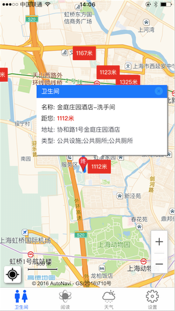
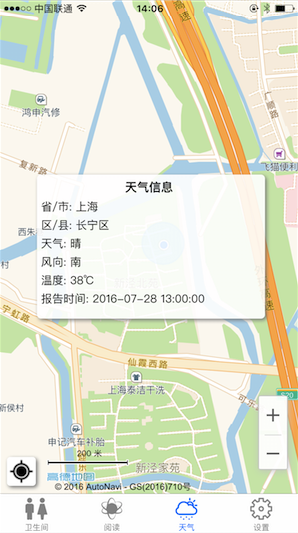
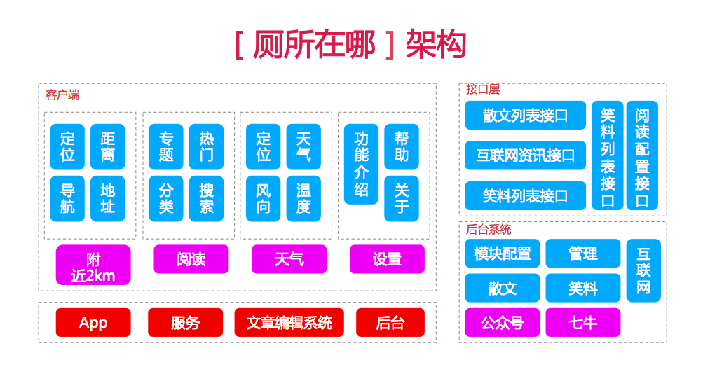

# 厕所在哪      

>## 缘起   

有一天在上班的途中，突然肚子不舒服，需要急需找到附近的卫生间。有过类似经历的同学，应当知道那种如狂风暴雨来的突然，如黑云密布那种无助......（省略号不代表什么，不要多想）为此，实现了该App。           
对于开发者来说，开发一款App，涉及到的条件还是蛮多的。比如需要服务接口、需要后台编辑系统、需要运营工具等。因此，该案例借助了高德开放平台的免费资源、七牛的免费图片存储、微信公众号的文章编辑系统、阿里云服务部署等。这一切，对于开发一款小型的App已经足够。如果能够极大的运用时代的福利，我们将极大的缩小开发App的时间。希望该项目能给想快速开发App的同学参考且带来益处。                  

>## 服务端

获取模块列表服务:   
       
	http://123.57.39.116:3000/data/read?type=cookies        
	http://123.57.39.116:3000/data/read?type=it      
	http://123.57.39.116:3000/data/read?type=manager        
	http://123.57.39.116:3000/data/read?type=sanwen       

获取首页配置:  
     
	http://123.57.39.116:3000/data/read?type=config       

>## 客户端

##### 地图中自动搜索附近2KM以内的卫生间，提供卫生间基础信息，以及路线导航规划。       
            
#### 文章阅读，包含推荐文章和分类                
               
#### 当地的实时天气      
                 
#### App Store (iOS 8.0+)  搜索“厕所在哪” 即可下载            

>## 架构  

